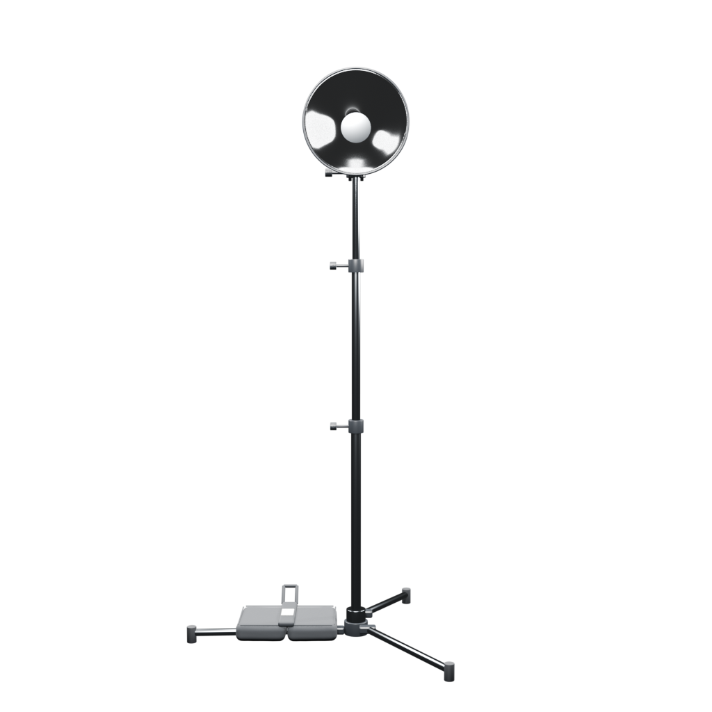
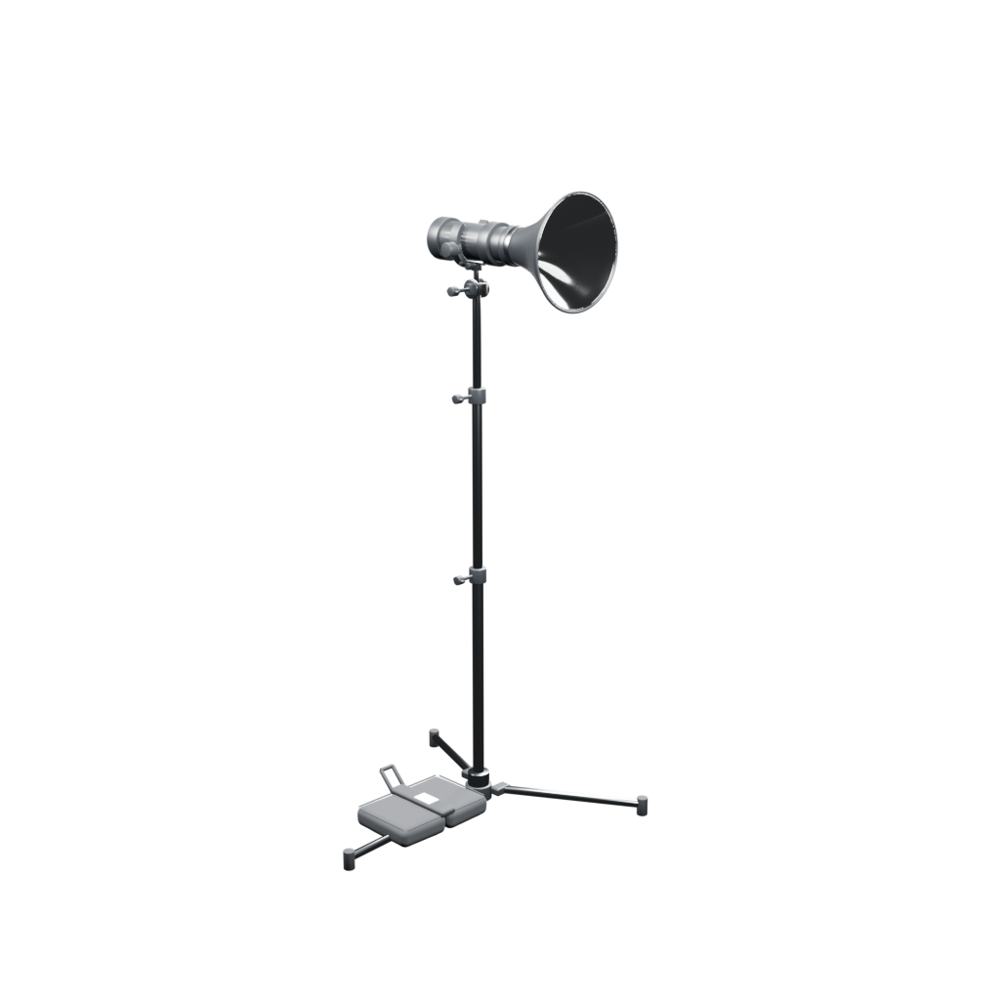
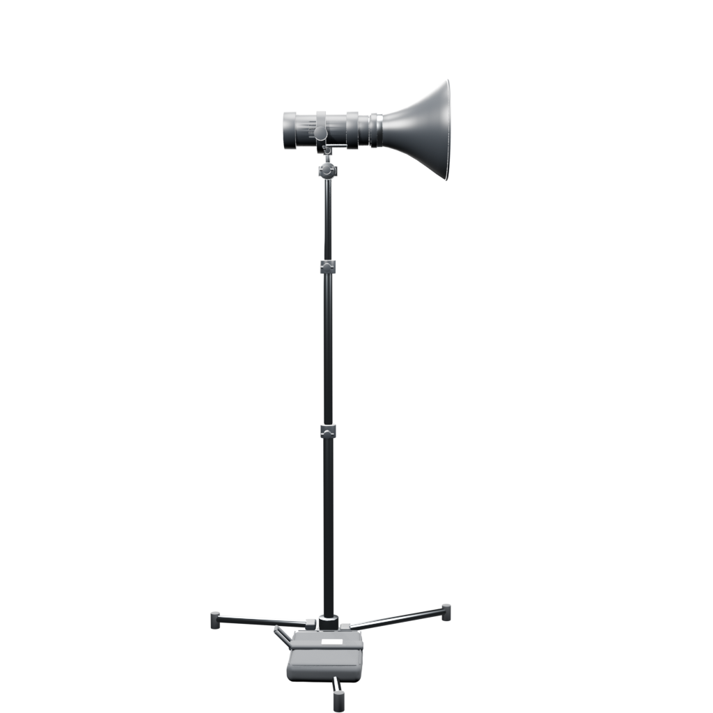
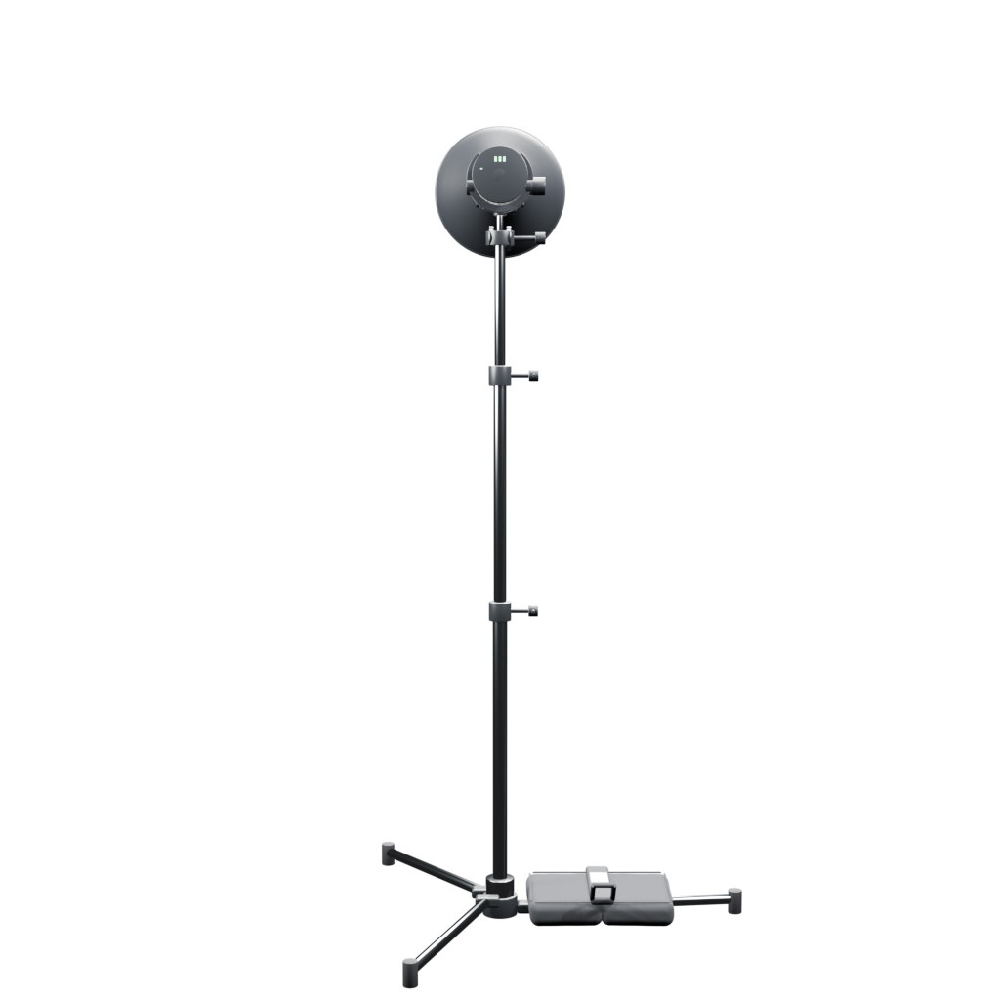
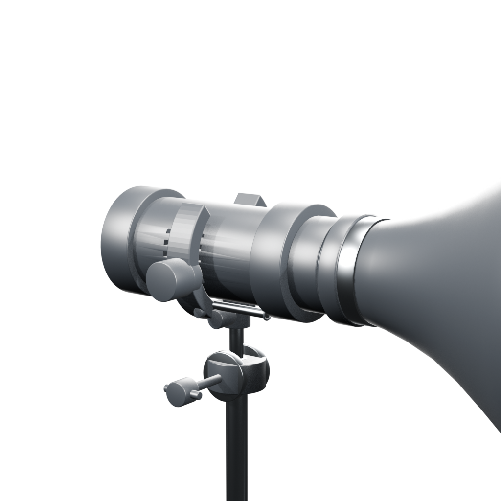
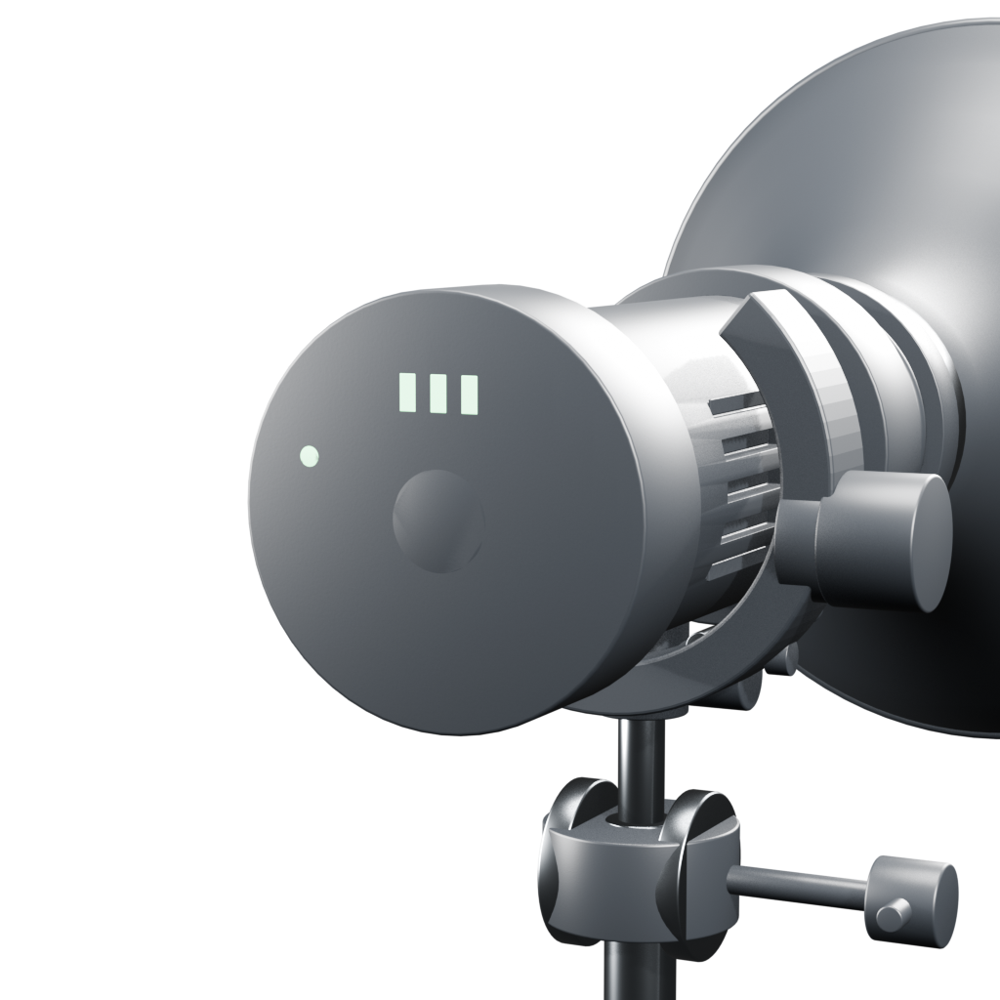
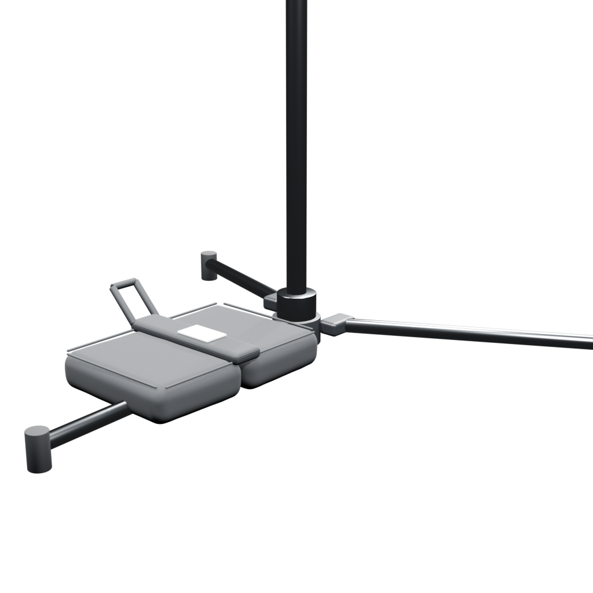

# AWFUL STUDIO — Studio Rig v01

Issue: #59  
Target: Blender 5.2.1 LTS  
Status: production blockout / early-mid geometry  
Asset root: `AS_RIG_STUDIO_V01`

## Included assets

- `AS_SUPPORT_CSTAND_01` — representative C-Stand standard, not claimed as historical Sensetique SKU.
- `AS_FIX_PROFOTO_D1_500` — Profoto D1 500 Air physical fixture.
- `AS_MOD_PROFOTO_MAGNUM` — Profoto Magnum Reflector 100624.
- `AS_ACC_SANDBAG_01` — representative studio sandbag.
- `LIGHT_D1_NATIVE` — separate native Blender light source.

## Verified dimensional contract

- Profoto D1 500 Air reference envelope: 300 × 130 × 170 mm.
- Profoto Magnum 100624: Ø345 mm × 265 mm depth.
- Support mount height in this rig preset: 1750 mm.
- Scene unit contract: 1 Blender unit = 1 metre.

`D1_REFERENCE_ENVELOPE` and `MAGNUM_REFERENCE_ENVELOPE` are non-rendering reference objects used only to preserve manufacturer dimension contracts. `validate.py` also measures visible assemblies separately, so decorative geometry cannot silently exceed the contract.

## Current geometry state

- D1 body uses cylindrical shell/rings, rear control plate, vent slots, carry handle and stand/tilt bracket.
- Magnum uses a non-linear revolved bowl profile rather than a straight truncated cone.
- C-Stand uses a staggered turtle base, telescoping risers, collars, T-handles, top grip head and baby pin.
- Sandbag uses two soft rectangular pouches, central webbing and handle.
- Fixture, modifier and support remain separate assets and can be reconfigured independently.

## Semantic contract

`FLOOR_CONTACT` → `MOUNT_SUPPORT` → `MOUNT_FIXTURE` → `MOUNT_MODIFIER`  
`EMITTER_ORIGIN` and `LIGHT_TARGET` describe the optical/light relationship without merging the native Blender Light into the physical mesh.

## Reproduction

Run `generate.py` using the pinned Blender 5.2.1 runtime. It writes the generated `.blend` and eight deterministic diagnostic renders. Then open that `.blend` headlessly and execute `validate.py`.

Current visual gate is intentionally **not final**. This slice has passed dimensional/runtime validation, but hero-detail, UV/bake, decals, surface wear and AWFUL STUDIO runtime catalog integration remain later stages.

## Preview gallery

These are deterministic Blender 5.2.1 diagnostic renders of the current candidate.

| Front | Three-quarter |
|---|---|
|  |  |

| Side | Rear |
|---|---|
|  |  |

## Macro QA gallery

| D1 / fixture | D1 rear controls |
|---|---|
|  |  |

| Magnum profile | C-Stand base + sandbag |
|---|---|
|  |  |

## Reference contract

- Profoto D1 500 Air: official Profoto user guide and discontinued product page.
- Profoto Magnum Reflector 100624: official Profoto product page and product sheet.
- C-Stand geometry reference: Avenger A2025F official Manfrotto / Avenger specification.
- Sandbag: representative professional studio pattern; no historical Sensetique SKU is claimed.
