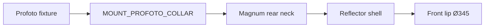
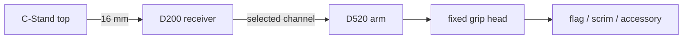

# Dimensional & Interface Diagrams — Wave 01

These are derived modeling diagrams, not manufacturer drawings. They intentionally contain only measurements and relationships needed to build our own geometry.

## Coordinate convention

AWFUL asset-local convention:

- `+Z` = up;
- `-Y` = visual/optical forward for fixtures unless an asset-family exception is documented;
- `+X` = asset right;
- dimensions stored in metres in Blender, millimetres in research docs;
- fixture optical axis = local `-Y`;
- support vertical axis = local `+Z`.

For a fixture mounted upright:

```text
          +Z
          ↑
          │
   -X ← ORIGIN → +X
          │
          └────────→ -Y = optical forward
```

## 1. Profoto D1 500 Air blockout envelope

Verified bounding dimensions:

- length / optical-axis envelope: 300 mm;
- body width envelope: 130 mm;
- body height envelope: 170 mm;
- weight: 2.44 kg.

Derived Blender blockout box:

```text
X = 0.130 m
Y = 0.300 m
Z = 0.170 m
```

Start with the exact envelope and fit photographed sub-forms inside it. Do not fit the envelope around a visually pleasing hand-modeled body afterwards.

### Side-view construction zones

```text
rear                                                     front
┌──────────┬──────────────────────────┬───────────────────────┐
│ controls │ body / vents / handle   │ reflector + glass     │
└──────────┴──────────────────────────┴───────────────────────┘
<------------------------- 300 mm --------------------------->
```

The zone boundaries are photographic-fit variables, not yet measured values. Keep them as non-destructive parameters in blockout.

### Required datum points

- `DATUM_OPTICAL_AXIS`
- `DATUM_FRONT_GLASS_PLANE`
- `DATUM_REAR_CONTROL_PLANE`
- `MOUNT_SUPPORT`
- `MOUNT_PROFOTO_COLLAR`
- `EMITTER_ORIGIN`

The modifier collar and emitter origin are not assumed to be at the 300 mm envelope extrema. They must be located by side-profile reference matching.

---

## 2. Profoto Magnum 100624 revolved envelope

Verified:

- front diameter: 345 mm;
- total depth: 265 mm.

Blockout cylinder envelope:

```text
radius = 0.1725 m
depth  = 0.2650 m
```

### Revolve-profile method

Create a 2D side profile with axial stations:

```text
Y0 = mount/collar reference
Y1 = rear neck transition
Y2 = cone/bowl inflection
Y3 = front lip inner
Y4 = front lip outer / front plane
```

Only `Y4 - Y0 = 265 mm` and max radius `R = 172.5 mm` are currently dimensional facts. `Y1–Y3` must be fitted from orthographic-like product photography.

Do not fabricate intermediate dimensions and later promote them to verified values.

### Mount logic



Modifier translation along the Profoto collar is a rig/configuration parameter. The reflector object's origin belongs at its mounting datum, not geometric center.

---

## 3. Zoom Reflector 100785

Verified:

- front diameter: 193 mm;
- depth: 180 mm.

Envelope:

```text
radius = 0.0965 m
depth  = 0.1800 m
```

Important: Magnum and Zoom have different normalized profiles. If profile coordinates are normalized to `(depth=1, radius=1)`, the control points must still come from separate traces.

---

## 4. Softlight Reflector shell 100607 / 100608

Verified shared shell envelope:

- diameter: 525 mm;
- depth: 190 mm;
- mass: 1.25 kg.

```text
radius = 0.2625 m
depth  = 0.1900 m
```

The shallow ratio is a defining characteristic:

```text
depth / diameter = 190 / 525 ≈ 0.362
```

Central deflector plate must live on optical axis and stay a separate component. Its diameter/offset remain research-fit values until measured from a strong orthographic reference.

---

## 5. RFi softbox family geometry table

| Model | Face | Depth | Rod count | Depth / major face |
|---|---:|---:|---:|---:|
| 2x3 254703 | 600 × 900 mm | 435 mm | 4 | 0.483 |
| 3x4 254704 | 900 × 1200 mm | 520 mm | 4 | 0.433 |
| 5' Octa 254712 | Ø1500 mm | 470 mm | 8 | 0.313 |

This proves the family must not be built by uniform scale. Each model has a distinct depth ratio and rod angle.

### Rectangular rod geometry

For a simple analytical starting cage:

- speedring center = `(0,0,0)`;
- front face center = `(0,-depth,0)`;
- front corners = `(±W/2, -D, ±H/2)` in fixture-oriented coordinates;
- rod straight-line length initial estimate:

`L = sqrt((W/2)^2 + (H/2)^2 + D^2)`

This is only a construction estimate. Actual rods bow under tension and connect to a finite-radius speedring, so source shape needs correction after visual matching.

### Octa geometry

For `n = 8` front corners:

`θ_i = 2πi / 8`

`P_i = (R cos θ_i, -D, R sin θ_i)`

with `R = 750 mm`, `D = 470 mm`.

Again, rod roots start at the actual speedring radius, not the central origin.

---

## 6. ARRI 300 Plus envelope and optical datum

Manufacturer current data:

- `H × W × L = 254 × 187 × 160 mm` including pin;
- `H × W × L = 209 × 187 × 160 mm` excluding pin;
- Fresnel lens diameter = 80 mm;
- accessory ring / barndoor class diameter = 130 mm;
- mount = 16 mm / 5/8 in.

Modeling implication:

The 45 mm difference between pin-inclusive and pin-exclusive height is not body-shell height. Do not scale the fixture shell to 254 mm high.

Derived body envelope start:

```text
body H = 209 mm
body W = 187 mm
body L = 160 mm
mount-inclusive H = 254 mm
```

Manufacturer 2D DXF/DWG exists and should be traced into our own dimension sheet before mid-poly approval.

---

## 7. Dedolight DLHM4-300 preliminary envelope

Secondary technical source gives unordered dimensions:

`171 × 132 × 174 mm`

and mass `1.02 kg`.

Until axis labels are corroborated:

```yaml
envelope_unmapped_mm: [171, 132, 174]
width_mm: UNKNOWN
height_mm: UNKNOWN
depth_mm: UNKNOWN
```

This is enough to reject wildly wrong scale, but not enough to pass precision-axis dimension gate.

---

## 8. Avenger A2025F representative C-Stand

Manufacturer facts:

- max height: 2530 mm;
- min height / closed height: 1100 mm;
- footprint max: 950 mm;
- column tube diameters: 35 / 30 / 25 mm;
- leg tube diameter: 25 mm;
- weight: 5 kg;
- top: 16 mm male.

### Column stack

```text
               16 mm baby pin
                    │
                 Ø25 riser
                    │
               [collar/T]
                    │
                 Ø30 riser
                    │
               [collar/T]
                    │
                 Ø35 column
                    │
                base casting
              ╱      │      ╲
           leg      leg      leg
```

Only diameters and full deployed/closed envelopes are verified here. Individual riser lengths and collar heights must be taken from manufacturer spare-parts drawing or orthographic fit before a historical-quality high model.

### Footprint validation

At fully deployed reference state, the XY bound should fit within a 950 mm maximum footprint. Do not assume an equilateral triangle of exactly 950 mm vertex-to-vertex without checking leg geometry.

---

## 9. D200 + D520 grip interface

D200 nominal disc/head class:

- Ø63.5 mm nominal;
- receiver: 16 mm;
- grip channels: 6.4 / 9.5 / 12.7 / 16 mm.

D520:

- arm length 1020 mm;
- fixed grip head with same four channel diameters.

Semantic graph:



This needs explicit channel metadata, e.g.:

```yaml
grip_channels_mm: [6.4, 9.5, 12.7, 16.0]
```

not a boolean `compatible=true`.

---

## 10. Scale sanity test scene

Every asset entering blockout gets placed in one deterministic scale scene containing:

- 1.8 m mannequin;
- 1 m calibration bar;
- 100 mm cube;
- A2025F representative stand at min and max height;
- camera at 50 mm equivalent, orthographic-like distance;
- front, side and 3/4 evidence cameras.

The test catches unit mistakes before detail work. Humans have invented enough ways to accidentally model a 52.5 cm beauty dish as 52.5 metres already.
