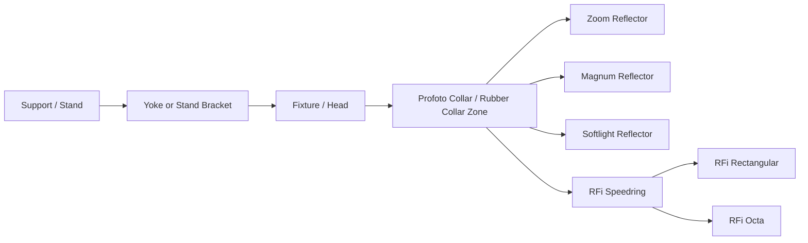

# Sensetique Studio Equipment — Research Pack, Wave 01

Status: `RESEARCH IN PROGRESS`

Purpose: establish modeling-grade evidence for the AWFUL STUDIO physical studio-equipment library and the configurable studio-rig system.

## 1. Historical inventory evidence

Confirmed from the current Sensetique portfolio equipment section and archived Sensetique studio pages:

### Flash / pack system

- Profoto D1 500 Air.
- Profoto Acute/D4 Head.
- Profoto Acute2 generator family, 1200/2400 class.

### Hard modifiers

- Profoto Magnum Reflector, product 100624.
- Profoto Zoom Reflector, product 100785.
- Profoto Softlight Reflector / Beauty Dish, historically shown as silver 26° on archived studio pages; current portfolio copy also includes the beauty-dish family.

### Soft modifiers

- Profoto RFi Softbox 5' Octa, 150 cm, product 254712.
- Profoto RFi Softbox 3x4', 90 x 120 cm, product 254704.
- Profoto RFi Softbox 2x3', 60 x 90 cm, product 254703, present on archived studio pages.
- Grifon SB-FW95 octabox, current portfolio identification 95 cm.
- Fotokvant Evenly stripbox 30 x 160 cm, Profoto-adapter configuration.

### Umbrellas

- Fotokvant U-104W Para, deep white reflective umbrella, 104 cm.
- Fotokvant U-101S, silver reflective umbrella, 101 cm.
- Lumifor LUSL-18016 ULTRA, translucent shoot-through umbrella, 180 cm, 16 fiberglass ribs.

### Continuous light

- Dedolight DLHM4-300, tungsten, 150 W lamp / integrated electronic supply.
- ARRI 300 Plus class tungsten Fresnel.

These continuous-light models appear in the archived Sensetique studio site and must be added to the asset family even though the current compact equipment presentation does not expose all of them.

---

## 2. Dimensional master table

| Asset | Product / SKU | Verified dimensions | Weight | Mechanical facts | Confidence |
|---|---|---:|---:|---|---|
| Profoto D1 500 Air | 901024-EUR / D1 500 Air | 300 x 130 x 170 mm | 2.44 kg | integrated reflector; stand bracket; flat-front glass; Profoto reflector collar; 3.5 mm sync; rear control panel | VERIFIED manufacturer |
| Profoto Acute/D4 Head | 900666 class | Ø100 x 220 mm depth | 1.55 kg | 16 mm / 5/8 in stand interface; fan cooled; zoom-reflector system; cable 4 m in 2017 catalog / 3 m in one guide revision | VERIFIED with revision conflict |
| Profoto Acute2 1200 | Acute2 1200 | 220 x 190 x 130 mm | 4.1 kg | pack/generator, separate head sockets | VERIFIED period catalog |
| Profoto Acute2 2400 | Acute2 2400 | 300 x 190 x 130 mm | 5.9 kg | pack/generator, separate head sockets | VERIFIED period catalog |
| Profoto Magnum Reflector | 100624 | Ø345 x 265 mm depth | 0.8 kg | zoomable along Profoto head collar; silver textured/hammered interior | VERIFIED |
| Profoto Zoom Reflector | 100785 | Ø193 x 180 mm depth | 0.3 kg | integrated grid holder; zoomable along head collar | VERIFIED product sheet |
| Softlight Reflector Silver | 100607 | Ø525 x 190 mm depth | 1.25 kg | central deflector plate; silver interior; 26° at pos. 4 | VERIFIED product sheet |
| Softlight Reflector White | 100608 | Ø525 x 190 mm depth | 1.25 kg | same shell family; white interior; 65° at pos. 4 | VERIFIED manufacturer |
| RFi Softbox 5' Octa | 254712 | Ø1500 x 470 mm depth | 3.0 kg | 8 steel rods; double diffusion; silver interior; separate RFi speedring | VERIFIED, depth corroborated |
| RFi Softbox 3x4' | 254704 | 900 x 1200 x 520 mm depth | 2.4 kg | 4 steel rods; recessed front; double diffusion | VERIFIED |
| RFi Softbox 2x3' | 254703 | 600 x 900 x 435 mm depth | 1.5 kg | 4 steel rods; recessed front; double diffusion | VERIFIED |
| Grifon SB-FW95 | SB-FW95 | Ø950 mm front | ~1.4 kg | 8 metal rods; silver interior; inner + outer white diffusers; standard retail version Bowens, historical portfolio states Profoto speed ring configuration | VERIFIED diameter, mount requires historical config treatment |
| Fotokvant Evenly strip | SBE-30160PF class | 300 x 1600 mm front | UNKNOWN | Profoto adapter version exists; special internal distribution design | VERIFIED front size, remaining dimensions UNKNOWN |
| Fotokvant U-104W Para | U-104W | Ø1040 mm canopy | 0.4 kg | deep/parabolic white reflective canopy; fiberglass ribs | VERIFIED basic dimensions |
| Fotokvant U-101S | U-101S | Ø1010 mm canopy | 0.35 kg | silver reflective interior; umbrella shaft | VERIFIED basic dimensions |
| Lumifor LUSL-18016 ULTRA | LUSL-18016 | Ø1800 mm canopy | UNKNOWN | 16 fiberglass ribs; neutral-white translucent fabric | VERIFIED diameter/ribs |
| Dedolight DLHM4-300 | DLHM4-300E / related voltage variant | exact body dimensions not yet locked | 1.02 kg | 150 W / 24 V lamp, integrated electronic supply, focus 48° to 4.5°, 16 mm mount, 4 m EU cable | PARTIAL VERIFIED |
| ARRI 300 Plus | L3.79200 / related variant | 233 x 187 x 160 mm body class; current ARRI gives 254 x 187 x 160 mm incl. pin, 209 x 187 x 160 excl. pin | ~1.8–2.0 kg | 80 mm Fresnel, 130 mm accessory ring, 16 mm mount, yoke, 4-leaf barndoor family | VERIFIED with catalog-era rounding/revision difference |

## 3. Source-of-truth hierarchy by asset

### Profoto D1 500 Air

Use manufacturer geometry as primary truth:

- body length 300 mm;
- width 130 mm;
- height 170 mm;
- mass 2.44 kg;
- max energy 500 Ws;
- 300 W modeling light;
- rear digital UI and hardware controls must be modeled as separate physical elements only where they affect close-up readability.

### Acute/D4 Head

Critical geometry:

- cylindrical head body around 100 mm diameter;
- depth 220 mm;
- yoke / stand mount is separate from head shell;
- glass dome / cover and flashtube zone are visually important hero details;
- cable exits and strain relief matter for silhouette;
- reflector collar is the common compatibility interface for Magnum / Zoom / Softlight family.

Cable-length conflict:

- one Profoto guide revision reports 3 m;
- the 2017 Profoto price list reports a 4 m lamp cable for SKU 900666.

Modeling decision: geometry should not hard-code total cable length. Cable must be procedural/curve-based with a configurable visible length. Metadata stores `source_cable_length_m = 4.0` for the 2017 230 V historical configuration, plus `reference_conflict = true`.

### Acute2 generator

Treat 1200 and 2400 as one parametric shell family where practical:

- same 190 x 130 mm cross-section;
- 1200 length 220 mm;
- 2400 length 300 mm;
- weight difference not represented geometrically;
- front/rear control and socket layouts must be checked against period photos before high-detail pass.

Do not derive generator geometry from the D1. They are different product architectures.

---

## 4. Configurable Profoto interface model

The most reusable design decision is the **shared light-head / modifier interface**.

Required semantic empties / mount points:

- `MOUNT_SUPPORT`
- `MOUNT_FIXTURE`
- `MOUNT_PROFOTO_COLLAR`
- `MOUNT_SPEEDRING`
- `MOUNT_UMBRELLA_SHAFT`
- `EMITTER_ORIGIN`
- `LIGHT_TARGET`
- `FLOOR_CONTACT`

Modifier replacement must preserve fixture pose, support pose and Blender native light settings.

---

## 5. Hard-reflector geometry analysis

### Magnum Reflector 100624

Modeling-critical dimensions:

- front diameter 345 mm;
- depth 265 mm;
- mass 0.8 kg.

Visible construction:

- deep rotationally symmetric aluminum reflector shell;
- silver textured/hammered interior is a roughness + normal problem, not a high-density displacement problem at runtime;
- black rear/collar assembly;
- sliding zoom fit over Profoto head;
- lip at the front rim;
- subtle thickness must be present at hero level.

Recommended geometry split:

- `GEO_SHELL_OUTER`
- `GEO_SHELL_INNER`
- `GEO_FRONT_LIP`
- `GEO_COLLAR`
- `GEO_LOCK`

Material split:

- powder-coated / painted exterior;
- high-reflectance textured aluminum interior;
- black rubber collar;
- dark plastic/metal lock components.

### Zoom Reflector 100785

Modeling-critical dimensions:

- diameter 193 mm;
- depth 180 mm;
- mass 0.3 kg.

Important differences from Magnum:

- shallower profile;
- integrated grid holder/rim structure;
- smaller front opening;
- do not scale Magnum down to make Zoom. Profile curvature and lip system are different.

### Softlight Reflector 100607 / 100608

Shared shell:

- diameter 525 mm;
- depth 190 mm;
- mass 1.25 kg.

Variant behavior:

- Silver 100607: silver interior, tighter/harder 26° behavior.
- White 100608: white interior, broader/softer 65° behavior.

The central deflector / reflector plate and its mounting hardware must be modeled because it is a defining shape and catches light in hero renders.

---

## 6. Softbox construction analysis

### RFi family design language

Shared construction contract:

- black technical fabric exterior;
- highly reflective silver interior;
- removable inner diffuser;
- removable front diffuser;
- recessed front edge;
- reinforced corner/edge seams;
- color-coded rod attachment system;
- separate speedring.

Do not model softboxes as pyramids with a white plane on the front. The quality difference will be obvious.

Required visible layers:

1. outer shell;
2. internal silver lining;
3. rod pockets / corner reinforcement;
4. rods;
5. speedring receiver points;
6. inner baffle;
7. outer diffuser;
8. Velcro / edge seam;
9. optional grid attachment strip.

### RFi 5' Octa 254712

- 1500 mm front diameter;
- 470 mm depth;
- 8 steel rods;
- 3.0 kg.

Create octagonal radial construction from a shared speedring root. Rod tension should produce a subtly convex side profile, not perfectly straight planar triangles.

### RFi 3x4' 254704

- 900 x 1200 mm face;
- 520 mm depth;
- 4 steel rods;
- 2.4 kg.

### RFi 2x3' 254703

- 600 x 900 mm face;
- 435 mm depth;
- 4 steel rods;
- 1.5 kg.

### Grifon SB-FW95

Confirmed current portfolio identification: 95 cm.

Retail reference construction:

- 8 metal rods;
- black heat-resistant polyester exterior;
- silver interior;
- white nylon diffuser(s);
- octagonal front;
- ~1.4 kg.

Historical mount conflict:

- generic retail product uses Bowens ring;
- current Sensetique portfolio copy explicitly describes a Profoto speed-ring configuration.

Modeling decision: the **softbox shell is one asset**, mount is a swappable adapter. Do not fuse a Bowens mount into the shell.

### Fotokvant Evenly 30 x 160

Known:

- 300 x 1600 mm front;
- Profoto-adapter SKU/configuration exists;
- design specifically targets reduced brightness drop across a long strip, roughly 0.1–0.4 stop according to the brand/retailer technical description.

Unknown before final blockout:

- exact depth;
- rod count/diameter;
- speedring dimensions;
- internal baffle geometry.

Until measured or found in manufacturer drawings, depth is `UNKNOWN`, not estimated.

---

## 7. Umbrella construction analysis

### Fotokvant U-104W Para

- 1040 mm canopy diameter;
- 400 g;
- deep/parabolic white reflective configuration;
- fiberglass ribs.

Model as a parametric radial system:

- central shaft;
- runner;
- stretchers;
- ribs;
- fabric panels;
- ferrule/end cap.

The open shape must be driven by profile depth, not only diameter.

### Fotokvant U-101S

- 1010 mm canopy diameter;
- 350 g;
- silver reflective interior.

Runtime material requires anisotropic-ish broken metallic response only at micro level. Do not make it mirror-like.

### Lumifor LUSL-18016 ULTRA

- 1800 mm canopy diameter;
- 16 fiberglass ribs;
- translucent neutral-white fabric.

This is a hero silhouette asset because 1.8 m scale and 16-rib structure are visually dominant. Geometry should preserve rib curvature and fabric panel sag.

---

## 8. Continuous-light fixtures

### Dedolight DLHM4-300

Historical presence: confirmed on archived Sensetique studio pages.

Technical facts:

- tungsten precision focusing fixture;
- 150 W / 24 V lamp;
- integrated electronic supply;
- focus range 48° to 4.5°;
- focus ratio 1:25;
- weight ~1.02 kg;
- 16 mm / 5/8 in mount;
- EU cable 4 m;
- any operating position except upside-down.

Modeling priorities:

- optical barrel and focus mechanism;
- yoke;
- rear integrated electronics housing;
- barn-door receiver / accessory ring;
- cable strain relief;
- black anodized/painted metal surfaces;
- glass optics and warm tungsten lamp interior.

Exact external body dimensions remain unresolved. Do not begin precision blockout until a dimensioned drawing or reliable orthographic reference is captured.

### ARRI 300 Plus

Historical presence: archived Sensetique site labels `ARRI 300`.

Manufacturer geometry:

- 300 W Fresnel;
- 3200 K tungsten;
- beam 14°–53°;
- Fresnel lens Ø80 mm;
- accessory / barndoor ring Ø130 mm;
- 16 mm mount;
- approximately 233 x 187 x 160 mm in period catalogs, with current manufacturer values separating pin-inclusive/exclusive height;
- approximately 1.8–2.0 kg depending catalog revision.

Modeling priorities:

- ribbed/vented cast/extruded aluminum body;
- blue/silver and black historical variants;
- yoke + tilt lock;
- focus knob/mechanism;
- front accessory ears/receiver;
- Fresnel lens geometry;
- 4-leaf barn doors as a separate articulated accessory.

The archived Sensetique field `diameter 101 cm` is rejected as invalid copied CMS data.

---

## 9. Material taxonomy for Wave 01

| Material family | Authoring | Runtime | Notes |
|---|---|---|---|
| Black powder-coated metal | procedural master | baked/procedural hybrid | macro roughness + fine orange-peel normal |
| Textured silver reflector | procedural master | normal + roughness + metallic | avoid geometry noise except lip/major dents |
| Anodized aluminum | procedural | procedural/light bake | restrained directional roughness |
| Black technical plastic | procedural | procedural | D1 controls, collars, knobs |
| Rubber collar / grip | procedural | normal/roughness | micro grain only |
| Fresnel glass | geometry + shader | runtime glass | real stepped lens geometry where visible |
| Frosted flash glass | geometry + shader | runtime glass | transmission + roughness |
| Silver softbox lining | procedural | packed maps | broken metallic/reflective fabric, not solid metal |
| Black softbox fabric | procedural | normal + roughness | woven textile response |
| Diffusion fabric | procedural master | opacity/transmission + normal | subtle weave, neutral white |
| Umbrella fabric | procedural master | transmission/roughness | radial tension changes roughness normals |
| Printed labels | decals | decals/atlas | typography, safety labels, product IDs |

---

## 10. Texture evidence requirements

For each hard-surface fixture collect:

- front / rear / left / right / top / bottom;
- 3/4 front and 3/4 rear;
- control panel macro;
- mount/yoke macro;
- cable exit and strain relief;
- label/serial zone;
- material close-up under grazing light;
- used-unit photos for realistic wear distribution.

For soft modifiers collect:

- fully open front;
- open rear / speedring;
- side profile;
- corner seam;
- rod pocket;
- inner baffle attachment;
- diffuser edge / Velcro;
- collapsed state;
- grid installed if applicable.

For umbrellas collect:

- side profile open;
- rear hub;
- runner + stretcher mechanics;
- rib end;
- fabric/rib join;
- closed state.

---

## 11. Geometry fidelity tiers

### HERO

Use for D1, Acute/D4 Head, Magnum, Zoom, Softlight, ARRI 300, Dedolight, Canon later.

Must support close shots, portfolio mockups and hero renders.

### STANDARD

Use for softboxes, umbrellas, stands, grip accessories when not occupying the frame.

Must preserve correct silhouette, mount compatibility and material identity.

### BACKGROUND

Simplified library variants for large studio setups.

No unique microdetail. LOD swap must preserve mounts and bounds.

---

## 12. Modeling order for the first studio family

1. Profoto common collar test fixture.
2. D1 500 Air blockout from verified bounding dimensions.
3. Magnum blockout from verified rotational profile envelope.
4. Generic temporary 16 mm support proxy.
5. Validate modifier swap and emitter alignment.
6. Finish D1 mid-poly and control-panel split.
7. Finish Magnum mid/high source.
8. Add Zoom as second reflector to prove common interface.
9. Add Softlight shell + silver/white variants.
10. Add RFi speedring and RFi 2x3' as first softbox.
11. Add 3x4 and 5' Octa from family rules.
12. Add Acute/D4 Head and verify the same modifier interface.
13. Add continuous fixtures as separate fixture family.

---

## 13. Quality gates before modeling starts

An asset may enter precision blockout only when:

- primary real-world dimensions are known;
- at least front/side/3-quarter reference exists;
- mount/origin policy is known;
- moving components are identified;
- material zones are identified;
- reference conflicts are documented.

Current `READY FOR PRECISION BLOCKOUT`:

- Profoto D1 500 Air;
- Profoto Magnum Reflector;
- Profoto Zoom Reflector;
- Profoto Softlight Reflector shell + silver/white variants;
- Profoto RFi 2x3';
- Profoto RFi 3x4';
- Profoto RFi 5' Octa;
- ARRI 300 Plus.

Current `RESEARCH MORE BEFORE PRECISION BLOCKOUT`:

- Dedolight DLHM4-300 external dimensions;
- Fotokvant Evenly strip depth/internal construction;
- generic/historical support stands;
- Canon body/lens exact SKU;
- furniture exact designs/manufacturers.

---

## 14. Historical data conflicts that must remain visible

1. **Grifon diameter**: current portfolio explicitly identifies SB-FW95 and 95 cm; archived studio site says Grifon octa 101 cm. Do not average or rescale. Treat SB-FW95 95 cm as primary until purchase records/photos prove another model.
2. **Acute/D4 cable**: 3 m in one guide, 4 m in a later period product/price document. Make cable parametric.
3. **ARRI 300 archived dimensions**: archived studio CMS contains a nonsensical 101 cm diameter field. Reject it.
4. **RFi 5' Octa depth**: current manufacturer product page exposes diameter and weight but not depth in all locales; historical Sensetique page and multiple retailers consistently give 47 cm. Use 470 mm with corroborated confidence.
5. **Mount adapters on third-party softboxes**: product shell and speedring must be independent assets. Retail SKU may be Bowens while historical studio configuration used Profoto.

---

## 15. Research continuation queue

### Wave 01B — supports and grip

Find and lock representative/historical versions of:

- C-stand with turtle base;
- light stand;
- boom;
- low stand;
- grip head;
- grip arm;
- baby pin/spigot;
- caster base;
- sandbag;
- cable routing accessories.

### Wave 01C — camera system

Do not model the proposed Canon 5D Mark IV / EF 24-70 II combination as historical fact yet. First identify exact body/lens from Sensetique archives, BTS photography, purchase records or clearly readable equipment photos.

### Wave 01D — furniture and props

Use Sensetique interior photography to identify the actual sofa/chairs/props where possible. If exact manufacturer cannot be proven, classify as `STUDIO_INSPIRED_RECONSTRUCTION`, never as a named replica.
