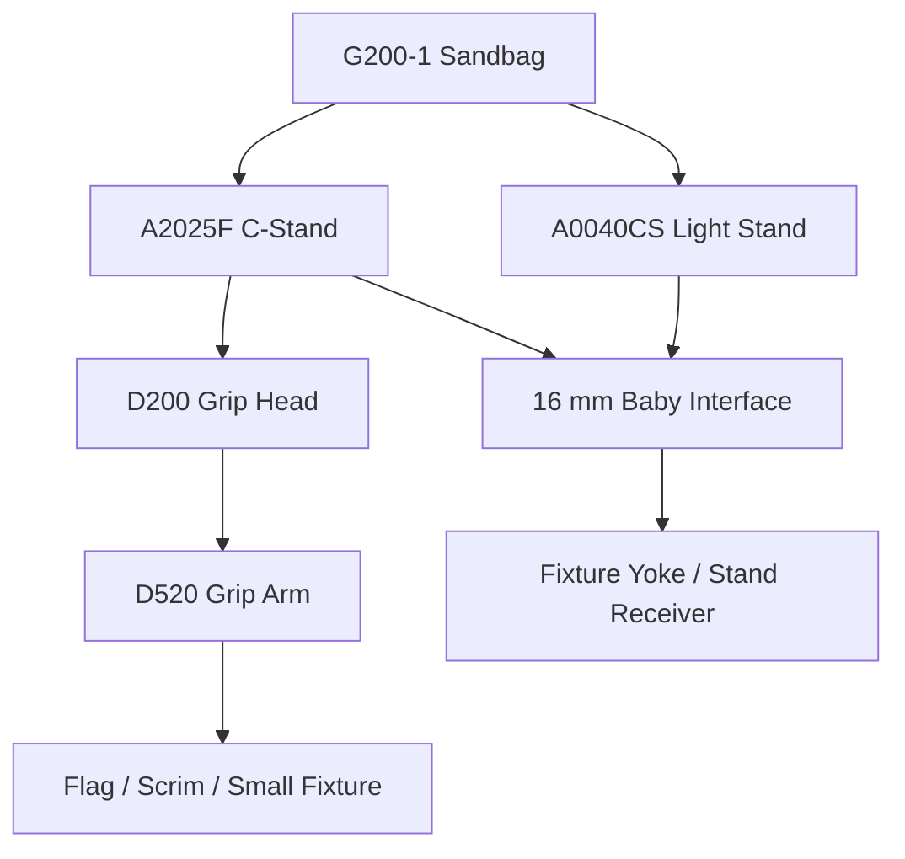

# Support & Grip Research — Wave 01B

Status: `REPRESENTATIVE STANDARD IDENTIFIED / HISTORICAL SKU UNCONFIRMED`

Purpose: define a mechanically correct support/grip family for AWFUL STUDIO while keeping historical Sensetique claims honest.

## Evidence policy

No current evidence proves that Sensetique specifically owned the Avenger SKUs below. They are therefore classified as `REPRESENTATIVE_PRODUCTION_STANDARD`, not `HISTORICAL_SENSETIQUE_REPLICA`.

Why Avenger is useful as the reference standard:

- manufacturer documentation exposes detailed tube diameters, mount sizes, heights, payloads and accessory compatibility;
- the 16 mm / 5/8 in baby interface matches the fixtures already in the research pack;
- C-stand + grip-head + grip-arm architecture is modular and maps cleanly to the AWFUL configurator;
- parts are industrially recognisable and technically documented instead of being invented from generic stock photos.

---

## 1. Representative C-Stand — Avenger A2025F

Manufacturer: Avenger / Manfrotto Group
Model: `A2025F`
Classification: `REPRESENTATIVE_PRODUCTION_STANDARD`

### Verified manufacturer data

- fixed-base 30 in C-Stand;
- maximum height: 2530 mm;
- minimum height: 1100 mm;
- closed height: 1100 mm;
- maximum footprint: 950 mm;
- weight: 5.0 kg;
- payload: 10 kg;
- 3 sections, 2 risers;
- center-column diameters: 35 / 30 / 25 mm;
- leg tube diameter: 25 mm;
- chrome-plated steel;
- 16 mm male top attachment;
- folding/nesting flat-leg architecture;
- intended compatibility with D200 grip head and D500-series grip arms.

### Modeling decomposition

`COL_BASE`
- fixed center casting;
- three independent rotating/folding legs;
- leg end caps;
- contact patches.

`COL_COLUMN`
- lower Ø35 mm column;
- middle Ø30 mm riser;
- upper Ø25 mm riser;
- collars;
- captive T-handles;
- top 16 mm baby pin.

### Articulation

- `leg_01_angle`
- `leg_02_angle`
- `leg_03_angle`
- `riser_01_extension`
- `riser_02_extension`

Runtime user-facing control should normally expose only stand height and collapsed/open state. Individual leg articulation belongs to source/advanced controls.

### Geometry notes

- chrome tubes need real cylindrical geometry and restrained bevels;
- locking collars and T-handles are silhouette-significant;
- do not model chrome surface scratches as geometry;
- nesting-leg height offsets are defining features of a C-stand and must be physical, not faked in texture.

---

## 2. Representative Grip Head — Avenger D200

Manufacturer model: `D200`
Classification: `REPRESENTATIVE_PRODUCTION_STANDARD`

### Verified data

- nominal head diameter: 2.5 in / 63.5 mm;
- weight: 0.55 kg;
- aluminum body;
- 16 mm / 5/8 in socket attachment;
- round grip holes: 6.4 / 9.5 / 12.7 / 16 mm;
- automotive-style brake-pad discs;
- T-knob lock with rubberized cover;
- secondary M10 locking-handle provision.

### Modeling decomposition

- left plate;
- right plate;
- brake/friction discs;
- central axle;
- receiver block;
- T-handle shaft;
- rubberized T-grip;
- secondary threaded feature.

### Rigging

- rotate around central grip-head axis;
- grip arm passes through one of the physical hole channels;
- use constraints only to enforce the selected channel and prevent impossible offsets.

The D200 should be a reusable component, not fused to the C-stand.

---

## 3. Representative Grip Arm — Avenger D520

Manufacturer model: `D520`
Classification: `REPRESENTATIVE_PRODUCTION_STANDARD`

### Verified data

- arm length: 1020 mm / 40 in;
- weight: 1.1 kg;
- chrome-plated steel arm;
- fixed aluminum grip head;
- fixed-head round holes: 6.4 / 9.5 / 12.7 / 16 mm;
- designed to work with D200 and C-stands.

### Geometry

- long tubular arm;
- end cap;
- fixed D520 grip-head assembly;
- brake discs;
- T-handle;
- hole channels.

`D520` and `D200` share a visual/mechanical component vocabulary. Build one common grip-head source family where dimensions overlap, but keep SKU-specific assemblies separate.

---

## 4. Representative heavy light stand — Avenger A0040CS

Classification: `REPRESENTATIVE_PRODUCTION_STANDARD`

This is useful as the tall conventional light-stand option, distinct from a C-stand.

### Verified data

- max height: 4000 mm;
- min height: 1420 mm;
- closed length: 1240 mm;
- weight: approx. 8 kg;
- payload: 9 kg;
- 4 column sections / 3 risers;
- tube diameters: 35 / 30 / 25 / 20 mm;
- leg section: 20 x 20 mm square steel;
- one leveling leg;
- 16 mm / 5/8 in top attachment;
- chrome-plated steel.

### Modeling significance

This should not share the C-stand base mesh. Its welded/mobile spider and square-section legs are a different support architecture.

---

## 5. Representative sandbag — Avenger G200-1

Classification: `REPRESENTATIVE_PRODUCTION_STANDARD`

Manufacturer facts currently useful:

- nominal load class: 10 kg when filled;
- empty product mass: 0.28 kg;
- black synthetic fabric;
- supplied without sand.

Exact filled dimensions are not exposed in the product summary. The asset should therefore be parameterized around volume/fill rather than claiming an exact historical envelope.

### Source/high construction

- two fabric lobes;
- center bridge/handle;
- stitched perimeter;
- filled granular volume;
- contact deformation against stand leg/floor.

### Runtime strategy

Store 2–3 deterministic shape variants rather than running cloth/granular simulation on spawn.

- `FLAT`
- `OVER_LEG`
- `STACKED`

Each variant keeps the same semantic origin and approximate mass metadata.

---

## 6. Boom reference — Avenger D600

Classification: `REPRESENTATIVE_REFERENCE / DATA CONFLICT`

Manufacturer prose states:

- minimum extension about 1170 mm;
- maximum extension about 2120 mm;
- payload up to 30 kg at minimum extension and 7 kg when fully extended;
- product mass 3.7 kg.

Some current structured product fields appear reversed/malformed (for example `Boom Max extension 117 cm` and `Boom Min extension 223 cm`). Do not encode those structured values until the manufacturer spare-part drawing/brochure is inspected.

Modeling status: `RESEARCH_MORE`.

---

## 7. Support compatibility graph

AWFUL semantic interfaces:

- `MOUNT_BABY_16_MALE`
- `MOUNT_BABY_16_FEMALE`
- `MOUNT_GRIP_HEAD`
- `MOUNT_GRIP_ARM`
- `FLOOR_CONTACT`
- `BALLAST_CONTACT`

Compatibility is metadata, not parent-name string matching.

---

## 8. Materials

### Chrome-plated steel

Source master:
- metallic response;
- smooth macro surface;
- faint manufacturing waviness only where reference supports it;
- fingerprints and fine longitudinal scratches as optional hero wear;
- no broad cloudy procedural dirt.

Runtime:
- mostly procedural Principled metal + low-cost roughness detail;
- reusable 1–2K micro-scratch tile if needed.

### Cast aluminum grip head

- slightly rougher than chrome tube;
- casting microtexture;
- machined hole interiors smoother;
- wear concentrated around holes, disc contact and T-handle interaction.

### Rubber handle cover

- molded rubber micro-grain;
- roughness 0.5–0.8 range depending reference;
- no random color speckle.

### Sandbag fabric

- black woven nylon/synthetic textile;
- stitching and seams source geometry where close;
- weave from normal/roughness;
- contact deformation baked into shape variants.

---

## 9. LOD policy

C-stands can appear many times in a studio scene, so instance cost matters.

### LOD0 HERO
- full knobs/collars;
- accurate tube wall/rim detail where visible;
- grip-head channels;
- end caps;
- high-quality chrome shading.

### LOD1 STANDARD
- preserve all tube diameters and silhouette;
- simplify T-handle cross sections;
- reduce grip-head internal detail.

### LOD2 BACKGROUND
- preserve leg architecture and riser silhouette;
- simplified collars/knobs;
- grip head merged by assembly where it does not break articulation.

### PROXY
- legs + column + mount only.

---

## 10. Decision for first vertical slice

Until historical support evidence appears, the vertical-slice support will use an explicit representative identity:

`AS_SUPPORT_AVENGER_A2025F_REP`

not a generic anonymous stand and not a falsely historical Sensetique SKU.

Pilot stack:

`A2025F_REP → 16mm interface → Profoto D1 500 → Profoto collar → Magnum 100624`

plus `G200-1_REP` sandbag variant.

This validates the actual interfaces needed by AWFUL STUDIO while leaving the historical question open and traceable.
