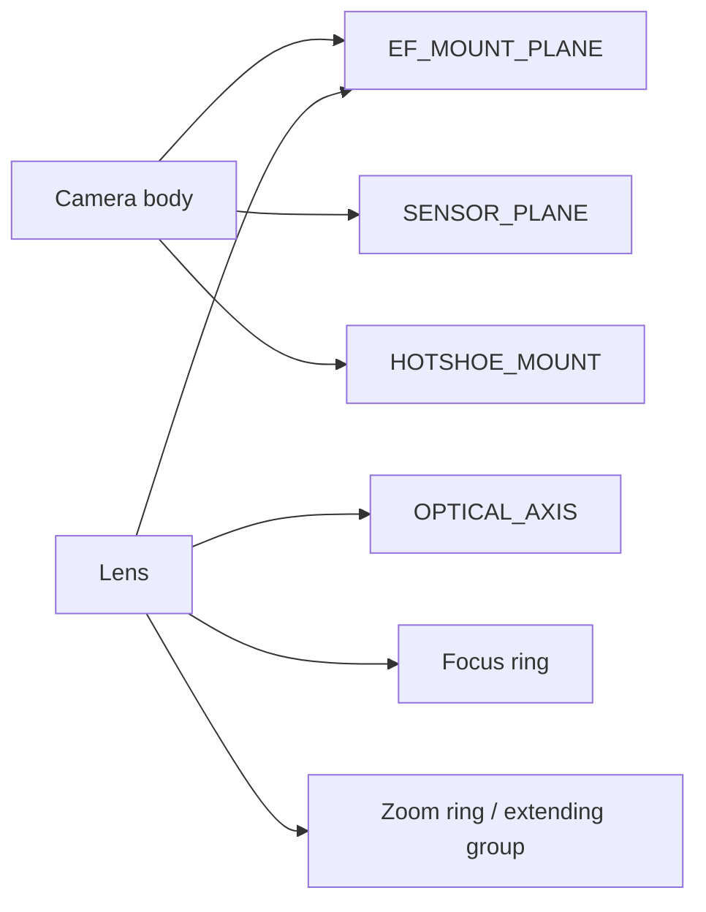

# Camera and lens hierarchy

```mermaid
graph LR
  B[Camera body] --> MP[EF_MOUNT_PLANE]
  B --> SP[SENSOR_PLANE]
  B --> HS[HOTSHOE_MOUNT]
  L[Lens] --> MP
  L --> OA[OPTICAL_AXIS]
  L --> FR[Focus ring]
  L --> ZR[Zoom ring / extending group]
```
