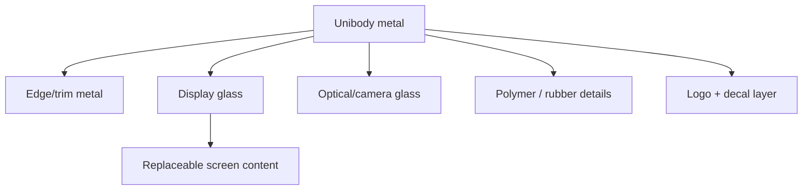

# Device material stack

```mermaid
graph TD
  U[Unibody metal] --> E[Edge/trim metal]
  U --> G[Display glass]
  G --> C[Replaceable screen content]
  U --> O[Optical/camera glass]
  U --> P[Polymer / rubber details]
  U --> D[Logo + decal layer]
```
