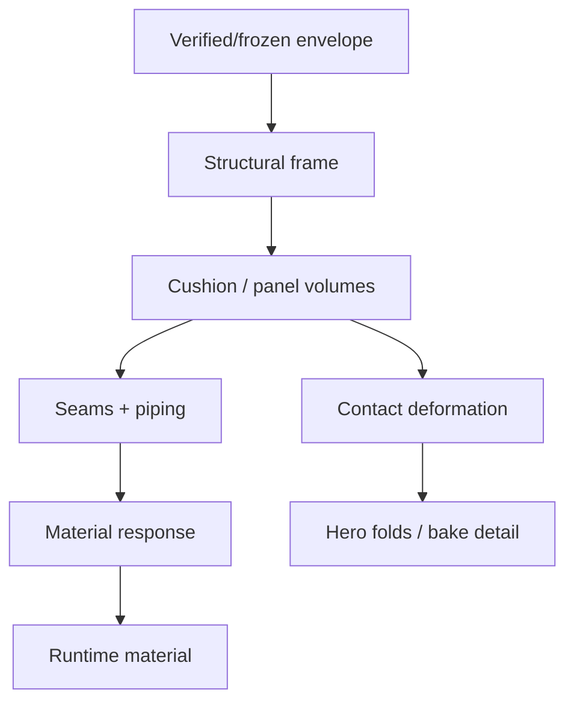

# Furniture construction layers

```mermaid
graph TD
  E[Verified/frozen envelope] --> F[Structural frame]
  F --> C[Cushion / panel volumes]
  C --> S[Seams + piping]
  C --> D[Contact deformation]
  S --> M[Material response]
  D --> H[Hero folds / bake detail]
  M --> R[Runtime material]
```
