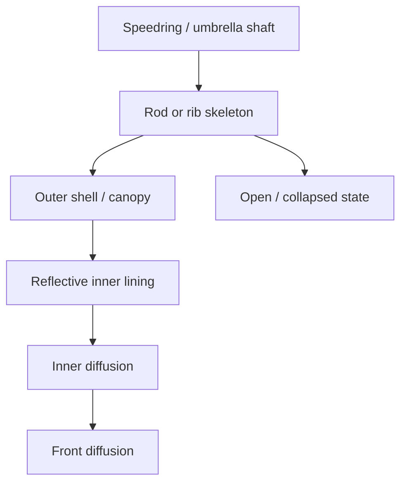

# Soft modifier construction

```mermaid
graph TD
  SR[Speedring / umbrella shaft] --> SK[Rod or rib skeleton]
  SK --> OS[Outer shell / canopy]
  OS --> IL[Reflective inner lining]
  IL --> ID[Inner diffusion]
  ID --> FD[Front diffusion]
  SK --> ST[Open / collapsed state]
```
