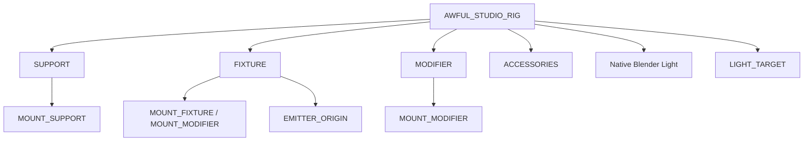

# Studio Rig hierarchy

```mermaid
graph TD
  R[AWFUL_STUDIO_RIG] --> S[SUPPORT]
  R --> F[FIXTURE]
  R --> M[MODIFIER]
  R --> A[ACCESSORIES]
  R --> L[Native Blender Light]
  S --> MS[MOUNT_SUPPORT]
  F --> MF[MOUNT_FIXTURE / MOUNT_MODIFIER]
  M --> MM[MOUNT_MODIFIER]
  F --> E[EMITTER_ORIGIN]
  R --> T[LIGHT_TARGET]
```
