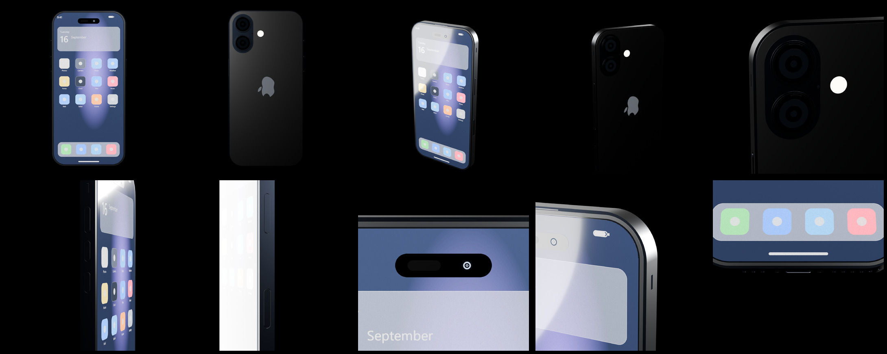
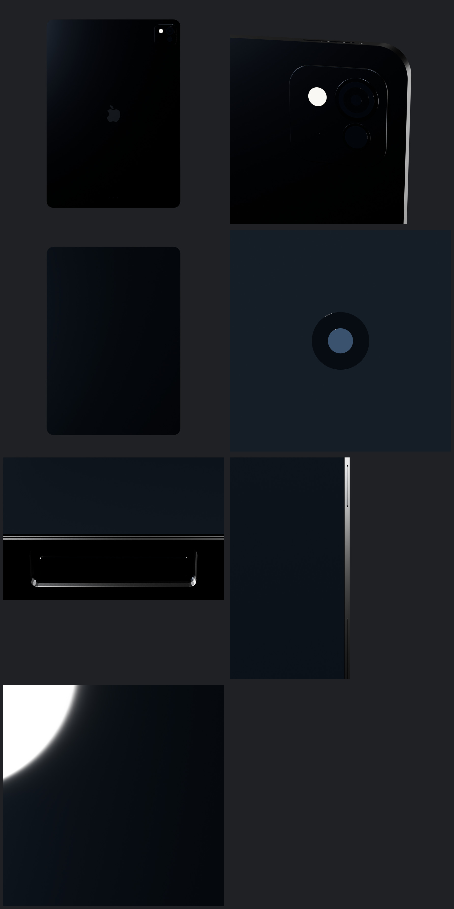
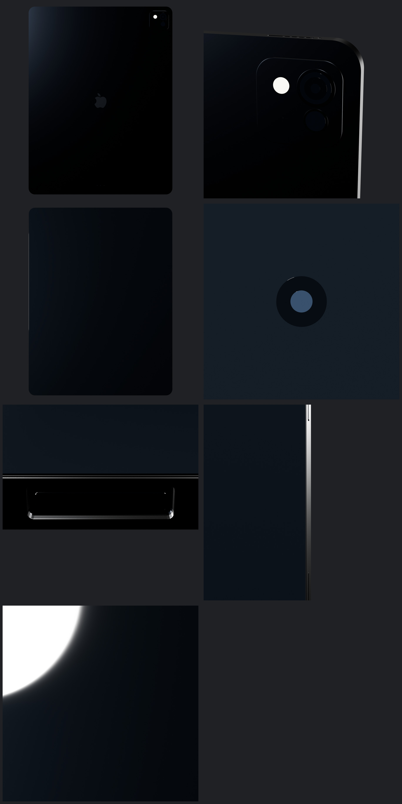
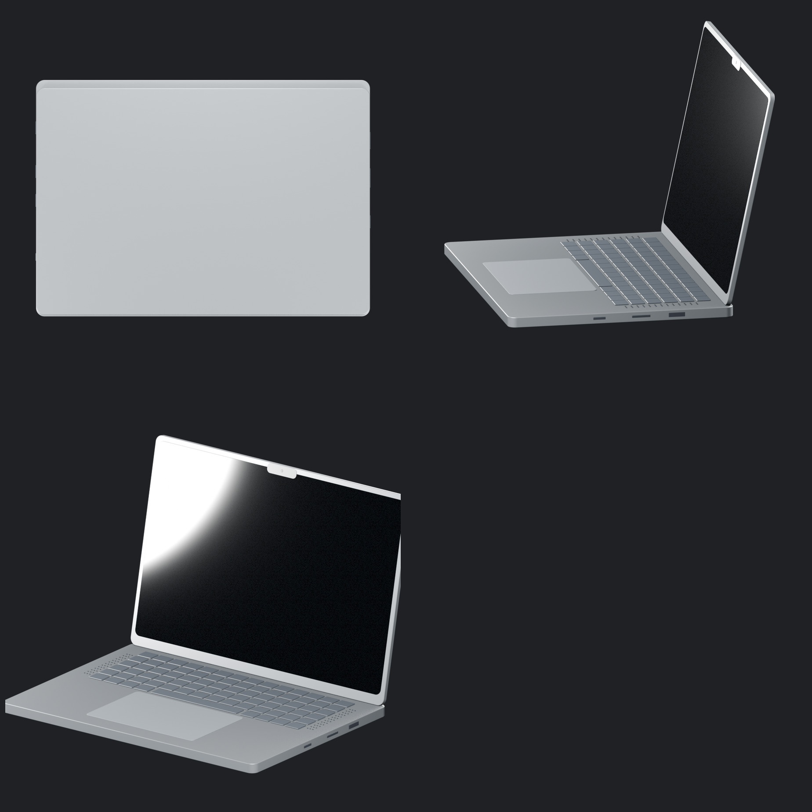

# Current device screenshots

Snapshot: 2026-09-16

These are the latest real preview renders currently present in the active device worktrees. No generated replacement imagery is used here.

## iPhone 17

Source: current production iPhone 17 asset, preview set `low_v30`.

[Open all iPhone 17 frames](./iphone-17/)

## iPad Pro 11

Source: `asset/ipad-pro`, current working preview set `11/low_v6`.

[Open all iPad Pro 11 frames](./ipad-pro-11/)

## iPad Pro 13

Source: `asset/ipad-pro`, current working preview set `13/low_v6`.

[Open all iPad Pro 13 frames](./ipad-pro-13/)

## MacBook Pro 14

Source: `asset/macbook-pro`, current preview set from the current low/release worktree.

[Open all MacBook Pro 14 frames](./macbook-pro-14/)
